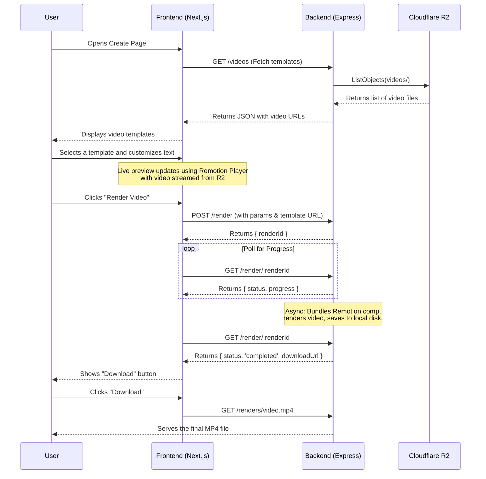

# Architecture Document: AI UGC App

This document outlines the architecture of the AI UGC (User-Generated Content) video creation application.

## 1. High-Level Overview

The application is a web-based tool that enables users to create short-form videos by customizing templates. It consists of two main parts: a **Next.js frontend** for the user interface and a **Node.js/Express backend** for video rendering and asset management.

- **Frontend**: A modern, interactive UI built with Next.js and React. Users select video templates, add text, and see a live preview of their changes.
- **Backend**: An Express.js server that handles the heavy lifting of video rendering using the Remotion library. It also communicates with Cloudflare R2 to fetch video assets.
- **Video Rendering**: The core video generation is powered by Remotion, which allows for programmatic video creation using React.
- **Asset Storage**: Video templates are stored in and served from Cloudflare R2, a cloud object storage service.

## 2. Project Structure

The project is organized into a monorepo-like structure, with the frontend and backend codebases located in separate directories:

- `/src`: Contains the entire Next.js frontend application.
- `/backend`: Contains the Express.js backend server responsible for rendering.
- `/public`: Holds static assets for the frontend.

---

## 3. Frontend (Next.js)

The frontend is responsible for the user experience, providing the tools for video customization and preview.

- **Framework**: [Next.js](https://nextjs.org/) (App Router)
- **Language**: [TypeScript](https://www.typescriptlang.org/)
- **UI**: [React](https://react.dev/), [Shadcn/UI](https://ui.shadcn.com/), and [Tailwind CSS](https://tailwindcss.com/)
- **Video Preview**: [@remotion/player](https://www.remotion.dev/docs/player) for real-time previews of the video composition.

### Key Components & Logic:

- **`src/app/create/page.tsx`**: The main "studio" page where users create their videos. It manages the state of all customizable video parameters (text, position, etc.), displays the selected video template, and orchestrates the communication with the backend.
- **`src/components/remotion/videoComposition.tsx`**: The core Remotion composition. This React component defines how the final video is structured, combining the selected video template with the user's text and other customizations. It is used by the Remotion Player for previews and by the backend for the final render.
- **`src/utils/videoRenderingClient.ts`**: An API client that centralizes all communication with the backend. It handles requests for starting renders, checking progress, and fetching video templates.
- **`src/components/ui/video-selector.tsx`**: A component that fetches and displays available video templates from the backend, allowing the user to choose one.

---

## 4. Backend (Express.js)

The backend handles the computationally intensive tasks and manages data sources.

- **Framework**: [Express.js](https://expressjs.com/)
- **Language**: [TypeScript](https://www.typescriptlang.org/)
- **Video Rendering**: [@remotion/renderer](https://www.remotion.dev/docs/renderer) and [@remotion/bundler](https://www.remotion.dev/docs/bundler).
- **Cloud Storage**: [AWS SDK for S3](https://aws.amazon.com/sdk-for-javascript/), configured to interact with the [Cloudflare R2](https://www.cloudflare.com/developer-platform/r2/) API.

### API Endpoints:

- `GET /health`: A simple health check endpoint.
- `GET /videos`: Fetches the list of available video templates from the Cloudflare R2 bucket. It returns a JSON array of video objects, including their public R2 URLs.
- `POST /render`: Receives a request from the frontend to render a video. It takes the user's parameters and template information as input and kicks off an asynchronous rendering process. It immediately returns a `renderId`.
- `GET /render/:renderId`: Allows the frontend to poll for the status of a rendering job (e.g., `rendering`, `completed`, `failed`) and its progress.
- `GET /renders/:renderId.mp4`: Serves the final, rendered video file from the local `/backend/renders` directory.

### Rendering Process:

1.  The `/render` endpoint is hit with the user's desired video parameters.
2.  A unique `renderId` is generated and the job status is stored in an in-memory cache.
3.  The backend starts an **asynchronous** process:
    a. It uses `@remotion/bundler` to create a Webpack bundle of the `videoComposition.tsx` component.
    b. It uses `@remotion/renderer` to programmatically render the composition to an MP4 file. The `templateUrl` (the public R2 URL of the video) is passed as a prop.
    c. The final video is saved to the `/backend/renders` directory on the server's local filesystem.
    d. The in-memory cache is updated with the progress and final status.
4.  The frontend polls the `/render/:renderId` endpoint to track progress and gets the final download URL upon completion.

---

## 5. Data & Asset Flow

The diagram below illustrates the complete workflow from the user's perspective.

